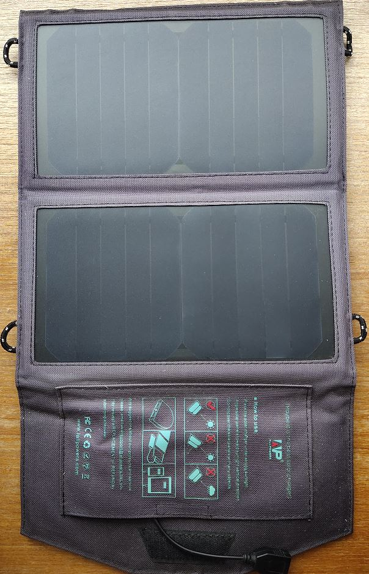
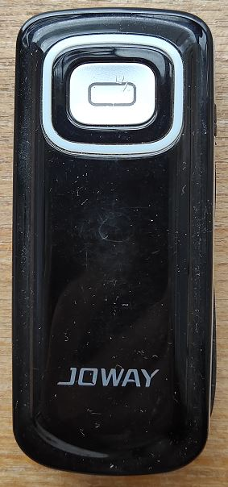
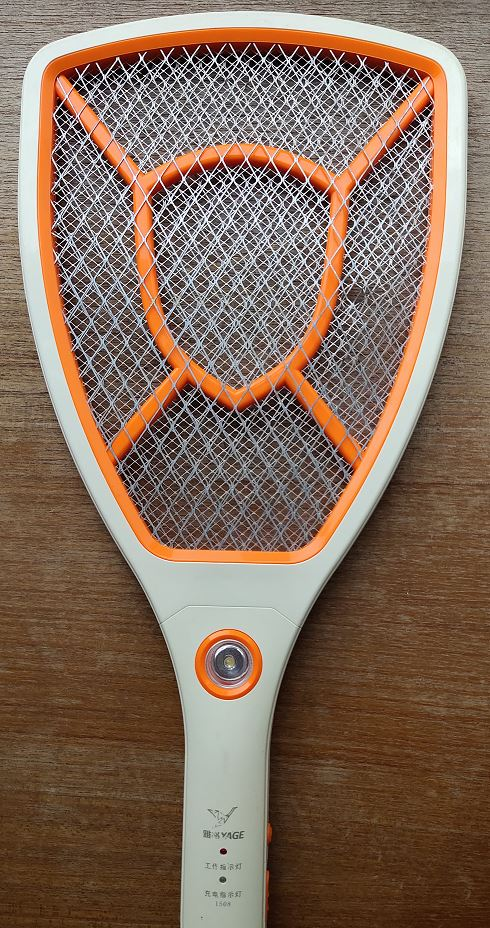
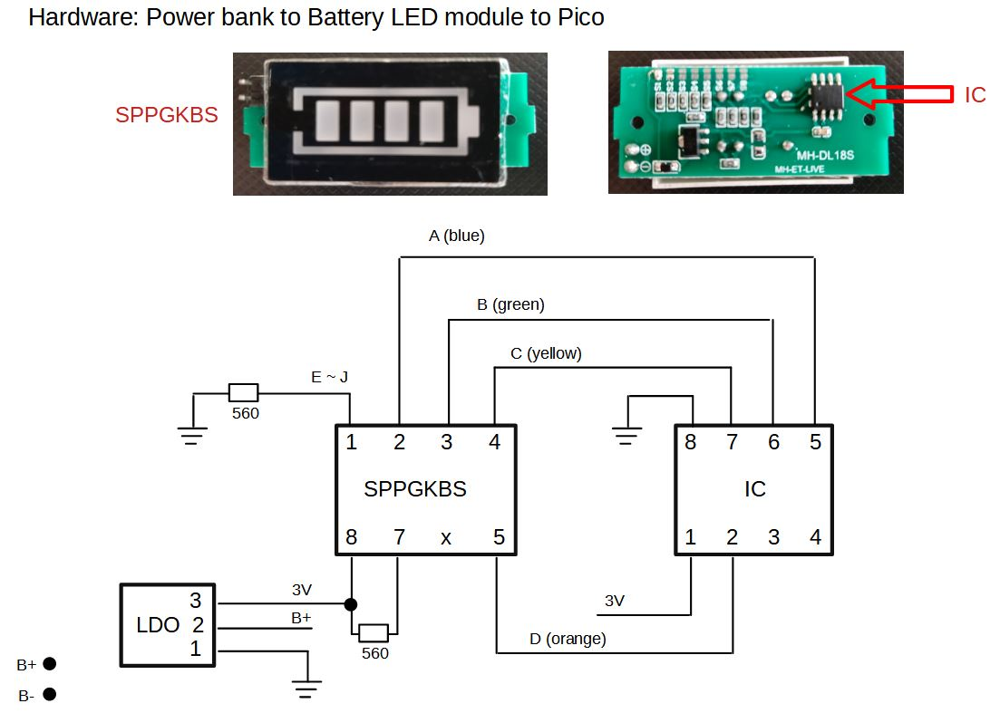
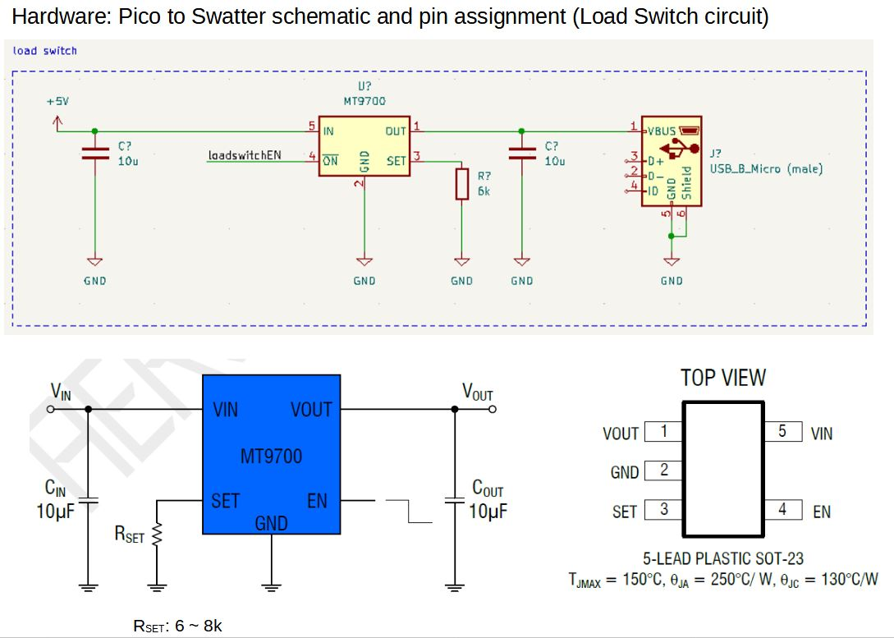
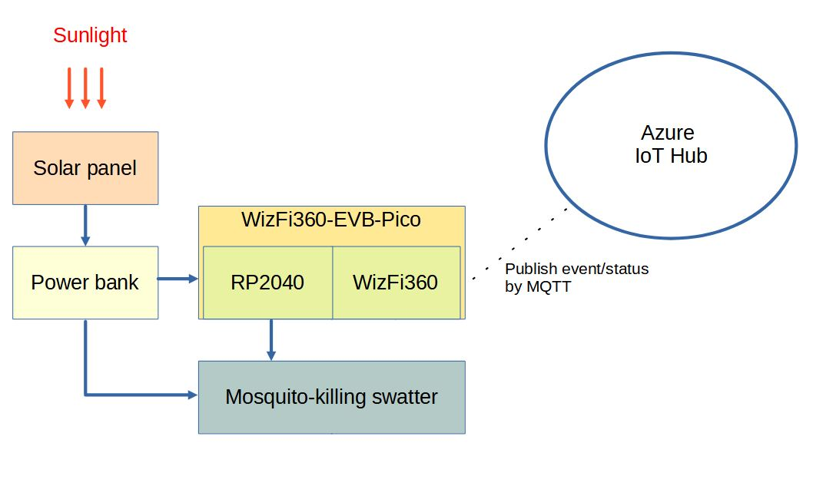
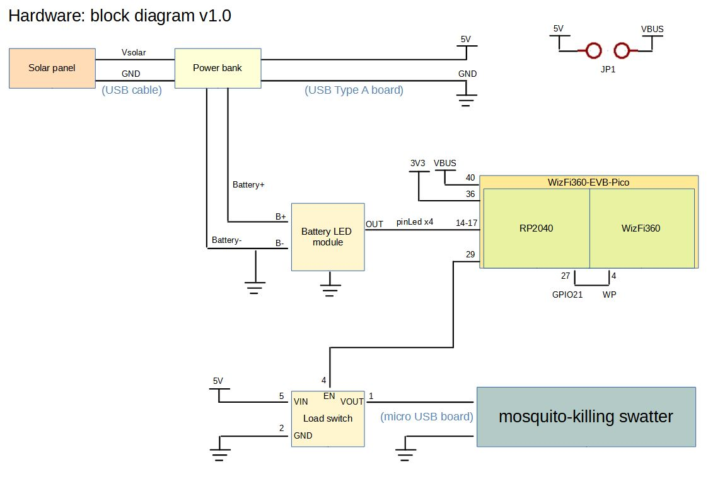
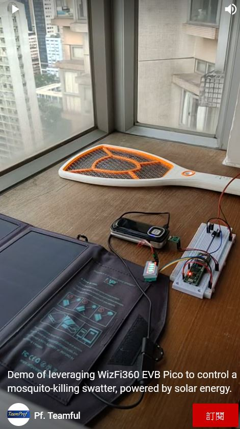

# arduino-solar-iot
## A solar powered mosquito-killing IoT project for Arduino, running on WizFi360-EVB-Pico board
---

[](https://github.com/teamprof/arduino-eventethernet/blob/main/LICENSE)

<a href="https://www.buymeacoffee.com/teamprofnet" target="_blank"></a>

---
## Important Notes
### 1. This project involves high voltage electronic circuit which requires professional knowhow. There is potential risk which is NOT suiable for general person.
### 2. DO NOT touch the swatter.
### 3. This project is target for [**WizFi360-EVB-Pico**](https://docs.wiznet.io/Product/Open-Source-Hardware/wizfi360-evb-pico) board at this moment.


---

## Why do we need this [Solar powered mosquito-killing IoT product](https://github.com/teamprof/arduino-solar-iot)

### 1. Mosquitoes aren't just annoying, they spread killer diseases, as well. They are often called one of the most dangerous animals on the planet (https://www.businessinsider.com/11-reasons-mosquitoes-are-the-worst-2014-4). 
### 2. Mosquito-killing swatter is one of weapons to kill Mosquitoes, however, it is battery powered which is difficult to provide 24x7 operations.
### 3. AC powered modquito-killing product has its limitation of installing on area without electricity, e.g. rural area.
### 4. A solar powered mosquito-killing IoT product is introduced to provide 24x7 operations without electricity power line.

---
## Features
#### 1. A solar panel provides energy on charging power bank. Solar energy is a clean energy which is a trend of providing human a better environment in future;
#### 2. Power bank provides power to [**WizFi360-EVB-Pico**](https://docs.wiznet.io/Product/Open-Source-Hardware/wizfi360-evb-pico) and Mosquitoe-killing swatter;
#### 3. [**WizFi360-EVB-Pico**](https://docs.wiznet.io/Product/Open-Source-Hardware/wizfi360-evb-pico) turns swatter on and off regularly. This reduces power consumption such that it supports 24x7 operations;
#### 4. [**WizFi360-EVB-Pico**](https://docs.wiznet.io/Product/Open-Source-Hardware/wizfi360-evb-pico) reports battery status to cloud every hour, this minimize resource of human supervision on site;

---

## Currently supported Boards

1. [**WizFi360-EVB-Pico**](https://docs.wiznet.io/Product/Open-Source-Hardware/wizfi360-evb-pico), using [**Arduino-mbed RP2040** core](https://github.com/arduino/ArduinoCore-mbed)

---

## Prerequisites
### Hardware
1. AllPowers Foldable Solar Panel Charger 5V10W with Built in USB (https://www.aliexpress.com/item/32859296874.html)
   [](https://github.com/teamprof/arduino-pico-solar-iot/blob/main/images/photo/hardware/solar-panel-2.JPG)

2. [Joway 6000mAh power bank](https://github.com/teamprof/arduino-pico-solar-iot/blob/main/images/photo/hardware/power-bank-1.jpg) (or a power bank who supports charging and discharging simultaneously)
   [](https://github.com/teamprof/arduino-pico-solar-iot/blob/main/images/photo/hardware/power-bank-1.JPG)

3. Yage YG-5617 mosquito-killing swatter 

   [](https://github.com/teamprof/arduino-pico-solar-iot/blob/main/images/photo/hardware/mosquito-swatter-1.JPG)

4. [WizFi360-EVB-Pico](https://docs.wiznet.io/Product/Open-Source-Hardware/wizfi360-evb-pico)

5. [Battery level detection board](https://item.taobao.com/item.htm?spm=a1z09.2.0.0.68e42e8d6qSWMp&id=624781563779&_u=l3no53d8eac4)
   [](https://github.com/teamprof/arduino-pico-solar-iot/blob/main/images/schematic/battery-detection.JPG)

6. Load switch board (please refer to MT9700 datasheet)
   [](https://github.com/teamprof/arduino-pico-solar-iot/blob/main/images/schematic/load-switch.JPG)

### Software
1. [`Azure IoT Hub](https://azure.microsoft.com/en-gb/services/iot-hub/)
2. [`Arduino IDE 1.8.19+` for Arduino](https://www.arduino.cc/en/Main/Software)
3. [`Arduino mbed_rp2040 core 2.7.2-`](https://github.com/arduino/ArduinoCore-mbed) 
4. ['Arduino DebugLog lib'](https://www.arduino.cc/reference/en/libraries/debuglog/)
5. [`WizFi360 library for Arduino'](https://www.arduino.cc/reference/en/libraries/wizfi360/)
6. [`ArduinoJson library'](https://arduinojson.org/)


---
## Demo 
### System block diagram
[](https://github.com/teamprof/arduino-pico-solar-iot/blob/main/images/system-block.JPG)

### Hardware block diagram
[](https://github.com/teamprof/arduino-pico-solar-iot/blob/main/images/hardware-block.JPG)

### Actual hardware connection
[](https://github.com/teamprof/arduino-pico-solar-iot/blob/main/images/photo/system-photo.jpg)

### main board
[](https://github.com/teamprof/arduino-pico-solar-iot/blob/main/images/photo/main-board.jpg)


# Video 
[](https://youtube.com/shorts/I1OqjLPGQjs?feature=share)
https://youtube.com/shorts/I1OqjLPGQjs?feature=share

### Screenshot on PC terminal (with serial terminal connected to Pico's UART0)
[](https://github.com/teamprof/arduino-pico-solar-iot/tree/master/images/screenshot/log-screen.png)

---


---

## Installation 
#### 1. Soldering a wire between RP2040's GPIO27 and WizFi360's pin4. (MUST)
#### 2. Connect all components shown in the "Actual hardware connection" section above (optional) (note: NO instruction on hardware is provided due to the potential risk of this high voltage application)
#### 3. Download arduino-pico-solar-iot-main.zip from github and extract to Arduino's user project folder.
#### 4. Install all Arduino lib shown in the "Prerequisites" - "Software" section above. (MUST)
#### 5. Create/Setup an Azure IoT Hub on cloud (MUST)
#### 6. Modify variables in "Credential.cpp" for your IoT Hub information. (MUST)
#### 7. Connect RP2040's UART0 (GPIO0, GPIO1) to PC's serial port, launch a serial terminal (NOT Arduino's Serial Monitor).
#### 8. Connect WizFi360 EVB Pico to PC with an USB cable, select the EVB's port. Compile and run in Arduino IDE.
#### If everything goes smooth, log data should be shown on the serial terminal. Azure IoT Hub should receive WizFi360 data within couple minutes.
#### If Azure IoT Hub does not recevie WizFi360 data, modify "BATTERY_REPORT_INTERVAL" value to 60 from 3600 on "github-pico-solar-iot.ino" line 30. Re-compile and upload again, Azure IoT Hub should receive WizFi360 data within couple minutes.


---
## Code Examples
### Since functions in WizFi360 lib are blocking operations, a separate thread is created in "setup()". This makes Arduino's loop() and WizFi360 runs in parallel. 
```
#define THREAD_WIZFI360_QUEUE_SIZE (256 * EVENTS_EVENT_SIZE) // message queue size for WizFi360 task
static ThreadWizFi360 threadWizFi360(THREAD_WIZFI360_QUEUE_SIZE);
void setup(void)
{
   ...

    threadWizFi360.start();
    threadWizFi360.postEvent(EventBatteryStatusUpdate, batteryLevel); // report battery status after bootup
}
```
### The traditional Arduino's loop() turns on/off swatter and monitoring battery status. The battery monitor code posts event to WizFi360 thread, if there is battery status change or every 60 minutes pass.
```
#define BATTERY_REPORT_INTERVAL 3600 // report battery level every 60 minutes
// #define BATTERY_REPORT_INTERVAL 60 // report battery level every 60 seconds (for testing only)

#define SWATTER_ON_TIME 10  // on for 10 seconds
#define SWATTER_OFF_TIME 40 // off for 40 seconds

void loop(void)
{
    // turn on swatter for 10s, then off for 40s
    static unsigned int swatterCounter = 0;
    if (swatterCounter++ == 0)
    {
        SwatterOn();
        ledOn();
    }
    else if (swatterCounter == SWATTER_ON_TIME)
    {
        SwatterOff();
        ledOff();
    }
    else if (swatterCounter >= (SWATTER_ON_TIME + SWATTER_OFF_TIME))
    {
        swatterCounter = 0;
    }

    // signal ThreadWizFi360 to report battery level hourly
    static unsigned int batteryCounter = 0;
    uint16_t level = battery.read();
    // LOG_DEBUG("level=", level);
    if (batteryLevel != level)
    {
        batteryLevel = level;
        threadWizFi360.postEvent(EventBatteryStatusUpdate, level);
    }
    else if (batteryCounter++ >= BATTERY_REPORT_INTERVAL)
    {
        threadWizFi360.postEvent(EventBatteryStatusUpdate, level);
        batteryCounter = 0;
    }

    delay(1000);
}
```
### When system bootup, WizFi360 thread initializes serial port, checks Wizfi360 hardware. If everything goes smooth, it starts SNTP process to synchronize RP2040's RTC to network time.
```
void ThreadWizFi360::setup(void)
{
    LOG_DEBUG("on core", get_core_num());

    uartWifi.begin(115200);
    uartWifi.onRxEvent([this]()
                       { postEvent(EventUartRx); });

    wizFi360DrvExtra.hardwareReset();
    WiFi.init(&uartWifi);
    if (wizFi360DrvExtra.wakeup())
    {
        setWizfiState(Wakeup);
    }
    else
    {
        setWizfiState(FatalError);
        LOG_ERROR("Fatal error: wizFi360DrvExtra.wakeup() returns false");
        return;
    }

    // if (!wizFi360DrvExtra.setSleepMode(WizFi360DrvExtra::LightSleepMode))
    // {
    //     LOG_ERROR("wizFi360DrvExtra.setSleepMode(LightSleepMode) failed");
    // }

    int sleepMode = -1;
    if (wizFi360DrvExtra.getSleepMode(&sleepMode))
    {
        LOG_DEBUG("wizFi360DrvExtra.getSleepMode()=", sleepMode);
    }
    else
    {
        LOG_ERROR("Fatal error: wizFi360DrvExtra.getSleepMode() returns false");
        return;
    }

    // check for the presence of the shield
    if (WiFi.status() == WL_NO_SHIELD)
    {
        LOG_ERROR("WiFi shield not present");
        wizfiState = FatalError;
        return;
    }

    initRTC();
    postEvent(EventWizfiSyncSNTP);
}
```
### WizFi360 goes into standby mode during idle, in order to save power consumption. If there is message to be sent to Azure, WizFi360 wakeup, connects WiFi AP, configures Azure settings, connects Azure and post MQTT message to Azure IoT Hub.
(note: an external wire connecting RP2040's GPIO27 and WizFi360's pin4 is required, in order to wakeup WizFi360 from standby mode)
### Detail code of WizFi360 thread is on ThreadWizfi360.cpp/.h
---


## Troubleshooting

If you get compilation errors, more often than not, you may need to install a newer version of the core for Arduino boards.

Sometimes, the library will only work if you update the board core to the latest version because I am using newly added functions.

---

## Issues

Submit issues to: [Solar powered IoT issues](https://github.com/teamprof/arduino-solar-iot/issues) 

---

## TO DO

1. Search for bug and improvement.
2. Extend to other green energy likes wind/water power generator.
3. Extend to different applications such as mosquitto index measurement or agriculture IoT system. 
4. A.I. algorithm to measure number of mosquitto killed.

---

## DONE
Basic demo of the followings:
1. Turn mosquito-killing swatter on 10s, then turn it off for 40s
2. Azure IoT Hub Connection, report battery status every hour 

---

## Contributions and Thanks

Many thanks for everyone for bug reporting, new feature suggesting, testing and contributing to the development of this library.

---

## Contributing

If you want to contribute to this project:

- Report bugs and errors
- Ask for enhancements
- Create issues and pull requests
- Tell other people about this library

---

## License

- The library is licensed under GNU LESSER GENERAL PUBLIC LICENSE Version 3
---

## Copyright

- Copyright 2022- teamprof.net@gmail.com

